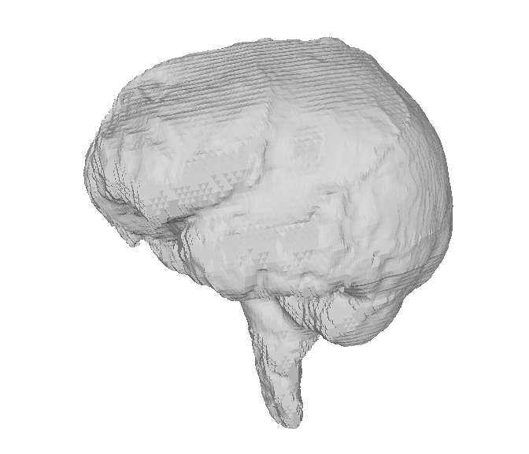

# Introduction

This is open for providing a prototyping software and data for the paper "Automatic Extraction of Endocranial Surfaces from CT images of crania".

# Software
 - [Version 0.1](https://github.com/tmichi/xendocast/releases/tag/0.1)
 
In this project, we used following two programs.

 - fillporosity : Porosity filling program
 - xendocast : Endocast extraction program (Main program)

fillporosity is a program to manipulate CT values at void voxels to user-specified threshold. xendocast is a program for extracting endocast region from CT images. Please visit the following link to download software ( for Win 64bit).
Note that the original program for filling porosity (Binarization step in the paper) is different from the fillporosity program provided above due to a licensing problem. However this provides almost equivalent features to the original program (but slow) .

## Requirement 
 - C++ compiler
 - Eigen (http://eigen.tuxfamily.org)
 - CMake ( Building codes) . 
 - [Microsoft Visual C++ 2015 Redistributable ](https://www.microsoft.com/en-us/download/details.aspx?id=53840) (if you use binary only)
 
## How to build 
### Mac (or Unix-like system (not tested)) 
```
$ cmake ..
$ make
```
### Windows 
 - Install Eigen somewehre(Set path where Eigen exists)
 - Run CMake to create Visual studio project files.  
 - Build by Visual studio XXXX.
 
# Usage
## fillporosity

```
    fillporosity -short -size 512 512 299 -h 0 -iso 800 -r 9 -ncp 3 -ncg 3 -thread 12 -i kuma3008-512x512x299-0.468x0.468x0.5.raw -o kuma3008-512x512x299-0.468x0.468x0.5f.raw
```

fillporosity program replaces CT values at small void structure in the cranium model to the threshold value . The arguments are listed below : 

 - -short: Voxel type (signed short, 2bytes) . -char (signed char, 1byte) , -ushort (unsigned short) and -uchar (unsigned char) are also available.
 - -size : The size of the volume data.
 - -h : Header size of the volume data (byte).
 - -iso : Threshold value for binarization
 - -r : Radius of sphere for structural element in mathematical morphology. 
 - -ncp : the number of iterations in constrained erosion to remove false voids.
 - -ncg : the number of iterations in constrained dilation. 
 - -thread : The number of threads in CPU computation. Use the number of cores. 
 - -i Input RAW File (binary RAW file ) . 
 - -o Output RAW file

## xendocast

```
    xendocast -short -thread 12 -fill -size 512 512 360 -pitch 0.468 0.468 0.468 -h 0 -iso 910 -auto -i  mladec1f.raw -o  mladec1.obj
```

xendocast is a program to extract endocast polygon from  CT images. The arguments are listed below:

 - -short: Voxel type (signed short, 2bytes) . -char (signed char, 1byte) , -ushort (unsigned short) and -uchar (unsigned char) are also available.
 - -size : The size of the volume data (3 values ) 
 - -pitch : Voxel resolution ( 3 values ) 
 - -h : Header size of the volume data (byte).
 - -iso : Isovalue for polygonization (Same as threshold value for voidextract)
 - -thread : The number of threads in CPU computation. Use the number of cores. 
 - -auto Automatic seed assignment
 - -i Input RAW File (binary RAW file ) . 
 - -o Output void file (wavefront OBJ file).The result can be visualized by opensource mesh editors ( e.g. MeshLab). 
 
## Example
 - Download "CT study of a cadaver head" dataset (16-bit TIFF files) from The Stanford volume data archive (https://graphics.stanford.edu/data/voldata/)
 - Convert tiff files to 3D raw data by ImageJ (http://imagej.nih.gov). The size will be 256x256x99 (unsigned short /voxel).
 - Run fillporosity program.
```
fillporosity -ushort -size 256 256 99 -h 0 -iso 1300 -r 6 -ncp 3 -ncg 3 -thread 12 -i cthead-256x256x99.raw -o cthead-256x256x99f.raw
```
- Run xendocast program.
```  
xendocast -ushort -thread 12 -fill -size 256 256 99 -pitch 1 1 2 -h 0 -iso 1300 -auto -i cthead-256x256x99f.raw -o cthead-256x256x99.obj
```
- The result polygon (cthead-256x256x99.obj) is shown below.




# Citation
When you publish papers by using the software, we kindly ask you to cite the following paper.(* Formal citation will appear after publication).

Takashi Michikawa, Hiromasa Suzuki, Masaki Moriguchi, Naomichi Ogihara, Osamu Kondo and Yasushi Kobayashi, "Automatic extraction of endocranial surfaces from CT images of crania".

# License

The code is distributed under MIT License.

# Contact
Takashi Michikawa < michikawa at acm.org >
